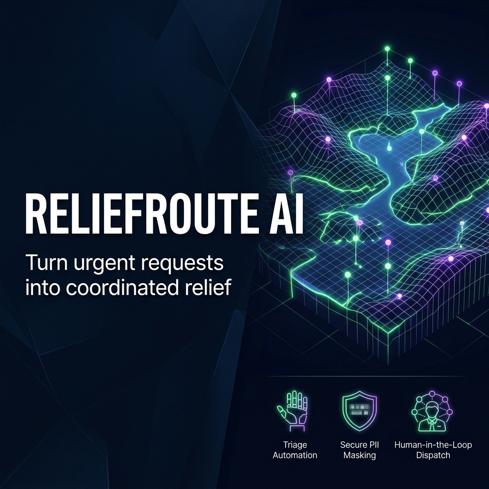
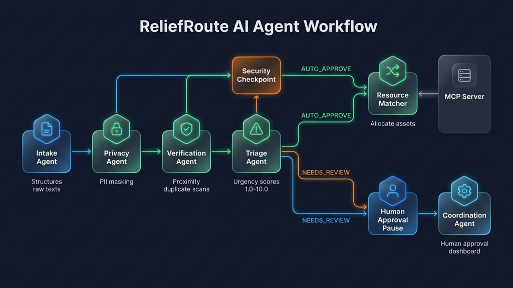

# ReliefRoute AI - Disaster Relief Triage Platform

ReliefRoute AI is an intelligent disaster-relief coordination platform powered by a collaborative Python multi-agent system. It automates the intake, verification, privacy protection, and resource matching of citizen help requests, presenting coordinators with a prioritized human-in-the-loop dispatch dashboard.

---

## Technical & Governance Q&A

### 1. What exact problem are we solving?
During sudden natural disasters (like flash flooding), response centers are overwhelmed by thousands of unstructured help requests arriving via SMS, WhatsApp, social media, and calls. Vetting, sorting, and dispatching rescue teams manually creates a major bottleneck, leading to:
- **Triage delays:** Critical medical emergencies get buried under lower-priority supply requests.
- **Logistical waste:** Multiple rescue boats are dispatched to the same family due to duplicate reports from different neighbors.
- **Privacy exposure:** Unvetted volunteers and administrators gain access to vulnerable citizens' names, phone numbers, and addresses, posing severe safety and data liability risks.

### 2. Why can’t a normal app solve it as well?
A standard CRUD database application is static. It can record form inputs and list them in a table, but it cannot:
- **Understand Semantics:** Parse a text message like *"water at waist level, grandfather needs his insulin, please hurry"* to understand that this is a critical medical hazard requiring high-clearance transport.
- **Fuzzy Duplicate Merging:** Deduplicate two requests for *"Lake Road Lane 2"* and *"Lake Gardens Block 2"* that originate from the same location but contain transcription typos.
- **Context-Aware Resource Routing:** Dynamically coordinate matches across changing supply hubs, volunteer skill sets, and spatial proximities without writing thousands of fragile, hardcoded if-else business rules.

### 3. Why do agents matter here?
Agents introduce **cognitive reasoning** and **flexible orchestration** to the workflow. Each agent behaves as a specialized expert: they evaluate context, search for information using tools, analyze constraints, and explain their decisions. Rather than forcing coordinators to sift through raw databases, the agentic pipeline synthesizes messy inputs, checks coordinates, matches resources, and suggests clear actions.

### 4. What does each agent do?
ReliefRoute AI utilizes a 6-agent cooperative pipeline:
1. **Intake Agent:** Parses raw unstructured text submissions into structured JSON request objects (extracting count, category, location, and vulnerabilities).
2. **Privacy Agent:** Evaluates data security boundaries. It interfaces with the security module to redact citizen names and contact details, ensuring developers and general operators only see safe, masked tokens.
3. **Verification Agent:** Scans coordinates and contact numbers of active cases. It calculates Haversine spatial distances to flag duplicate tickets (e.g. location proximity < 250m) and recommends mergers.
4. **Triage Agent:** Assesses the urgency score (1.0 to 10.0) based on categories (medical/rescue vs sanitation/food), vulnerability tags (infants, elderly, pregnancy, disability), and semantic indicators of threat.
5. **Resource Matcher Agent:** Dynamically queries available personnel databases and hubs to match the closest volunteer with the corresponding skill and reserve supply packages.
6. **Coordination Agent:** Gathers the triage scores, verification confidences, duplicate alerts, and asset matches. It generates the recommended action, writes the audit event, and queues the ticket for human review.

### 5. What MCP tools are used?
Model Context Protocol (MCP) servers allow our agents to securely query external database tools and dispatch actions. The following MCP servers are simulated in our architecture:
- **Disaster Data Server (`query_flood_level`, `get_active_warnings`):** Retrieves rainfall, flood depth, and meteorological telemetry for coordinates.
- **Inventory Server (`check_inventory_stock`, `reserve_inventory_kit`):** Verifies supply quantities at relief staging points and subtracts allocated kits.
- **Volunteer Server (`query_volunteers`, `assign_volunteer`):** Finds nearby field responders matching the required skills (e.g., rescue, medical) and updates their status.
- **Notification Server (`send_alert`):** Simulates sending automated SMS or WhatsApp alerts to responders and citizens upon dispatch activation.

### 6. How is personal data protected?
Data protection is built directly into the agent pipelines and database schemas:
- **PII Masking at Rest/Display:** Citizen name and phone numbers are masked on submission (e.g. `A**** K*****` and `+91 ******2345`). Masked values are stored and displayed on the dashboard.
- **Human-in-the-Loop Decryption:** Sensitive PII is locked and cannot be decrypted by field responders. Only when an authorized Coordinator clicks **Approve & Dispatch** does the backend unlock the contact details, allowing responders to call the citizen.
- **Role-Based Access Control (RBAC):** Permissions are strictly partitioned: Citizens can only write requests, Field Responders can only view assigned dispatches, and Coordinators hold approval and inventory controls.

### 7. What is simulated vs real data?
- **Simulated:** Python agent reasoning models (simulating LLM cognitive weights using rule-based algorithms), live weather telemetry warnings, and automated SMS alerts dispatch.
- **Real:** Persistence database operations (FastAPI reading/writing to `db.json`), GPS coordinate distance mathematics (Haversine formula), React SVG coordinate maps, and full CORS network endpoints communicating with the React UI.

### 8. What would be needed for real-world deployment?
To transition ReliefRoute AI from this high-fidelity simulation to a production deployment, the following components would be required:
1. **Production LLM integration:** Hook up the Python agents to Gemini 1.5 Pro/Flash APIs via the Google ADK SDK.
2. **Secure Authentication:** Integrate OAuth2, SAML, or Firebase Auth to manage Coordinator and Responder user sessions.
3. **Persistent SQL Database:** Replace the local `db.json` with a secure PostgreSQL database with PostGIS extensions to manage geographical spatial queries.
4. **Real Notification Gateways:** Connect the notification server tools to Twilio or WhatsApp Business APIs.
5. **GIS Map Overlays:** Swap the custom SVG map for Leaflet/Mapbox connected to live emergency services ArcGIS maps.
6. **Container Hosting:** Deploy the frontend and backend microservices on Google Cloud Run or GKE with Secret Manager storing API credentials.

---

## Local Development Setup

To run the application locally on your host machine:

### 1. Backend Agents API (Python)
Ensure Python 3.10+ is installed:
```bash
# Install dependencies
pip install -r requirements.txt

# Start the agents server
python server_agents.py
```
*The backend server will launch on [http://localhost:8000](http://localhost:8000).*

### 2. Frontend client (Node/Vite)
Navigate to the frontend folder and run the client dev server:
```bash
cd frontend
npm install
npm run dev
```
*The client dev server will launch on [http://localhost:5173/](http://localhost:5173/). All API queries will automatically proxy to the Python backend on port 8000.*

---

## Running with Docker Compose

To launch the entire platform in isolated containers:
```bash
# Starts both frontend and backend-agents services
docker-compose up --build
```
Once built, open [http://localhost:5173](http://localhost:5173) in your web browser.

---

## Demo Script
A complete spoken narration script for presenting the platform features and visual architecture is available in [DEMO_SCRIPT.txt](DEMO_SCRIPT.txt).

---

## Assets

### Cover Page Banner


### Agent Workflow Diagram


